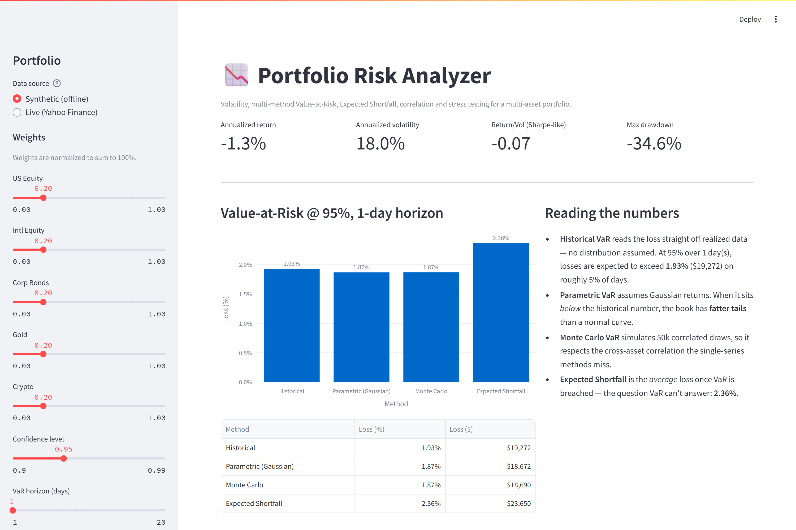

# Portfolio Risk Analyzer

An interactive quant-risk dashboard for multi-asset portfolios. Point it at a
set of holdings and it reports **volatility, Value-at-Risk (three methods),
Expected Shortfall, the correlation structure, and stress tests against real
historical crises** — in a clean Streamlit UI.

Runs on deterministic synthetic data out of the box (no setup, no internet),
or pulls live adjusted prices from Yahoo Finance.



> Built to be read as much as run: the risk engine is a small, dependency-light
> module (`risk.py`) with unit tests, kept separate from the UI so it can be
> reused in a notebook or behind an API.

---

## What it computes

**Core risk metrics** (over a recent risk window, so they reflect the current regime)
- Annualized return & volatility, return/vol ratio, max drawdown
- **Value-at-Risk**, three ways, shown side by side so the differences are visible:
  - *Historical* — empirical tail, no distributional assumption
  - *Parametric (Gaussian)* — variance-covariance; understates fat tails by design
  - *Monte Carlo* — 50k correlated draws from the sample mean/covariance
- **Expected Shortfall (CVaR)** — the average loss *beyond* VaR
- Cross-asset **correlation matrix**

**Stress testing** — two complementary, deliberately non-naive views
- **Historical event scenarios** apply each crisis's *realized per-factor*
  shocks (Equity / Credit / Gold / Crypto move differently — gold can rally
  while equities crash), scaled by each position's sensitivity to its factor.
  Covers the GFC (2008), the Euro debt crisis (2011), the COVID crash (2020)
  and the 2022 rate shock. Positions that did not exist during an event are
  **flagged as proxies**, with inception read automatically from price history.
- **Worst realized window** reads the portfolio's own worst 1/5/21/63-day
  stretch off the *full* available history (back through 2008/2020 when the
  holdings are old enough), with the exact dates it happened.

---

## Why the design choices

- **Factor-based stress, not a flat "market −20%".** A single market-wide shock
  is fiction: assets don't move together and some hedge. Mapping each holding to
  a risk factor and applying realized per-factor shocks reflects that.
- **Two time windows on purpose.** Vol/VaR use a recent window (current regime);
  the worst-realized-window stress uses full history (to actually contain
  crises). They answer different questions.
- **Honest proxies.** When a holding postdates an event, or its factor is
  inferred for a non-catalog ticker, the app says so instead of hiding it.
- **Robust data layer.** One invalid ticker is dropped and reported, never
  allowed to silently wipe the whole portfolio.

---

## Quickstart

```bash
pip install -r requirements.txt
streamlit run app.py
```

Then use the sidebar to choose **Synthetic (offline)** or **Live (Yahoo
Finance)**, pick assets, set weights, confidence level, horizon and portfolio
value.

## Project structure

```
risk.py          # Risk engine: returns, VaR (3 methods), ES, stress, drawdown
data.py          # Data + reference layer: synthetic sim, live prices, asset
                 # catalog, factor map, historical events
app.py           # Streamlit UI
test_risk.py     # Sanity tests for the risk engine
requirements.txt
```

## Tests

```bash
python -m pytest -q        # or: python test_risk.py
```

The tests pin the properties that matter: VaR is non-negative and grows with
confidence, Expected Shortfall dominates VaR, parametric VaR matches the closed-
form Gaussian quantile, and horizon scaling follows the square-root-of-time rule.

## Notes & limitations

- Historical event shocks are realistic but illustrative; a production setup
  would map shocks per granular risk factor and use a full risk-factor model.
- Monte Carlo VaR assumes multivariate-normal returns calibrated to the sample.
- Live data depends on Yahoo Finance availability.

## Tech

Python · numpy · scipy · pandas · plotly · streamlit · yfinance
